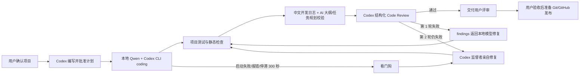

# 本地 AI MVP 环境实施计划

## 目标架构

## 阶段与验收

1. 硬件与模型审计
   - 验收：记录硬件、内存、磁盘、运行时和精确模型包体；排除不适配模型。
2. 本地运行时
   - 安装 `qwen3-coder:30b`，随后按需安装 `qwen3.6:35b`。
   - 验收：Ollama API 可见模型，32K 上下文下完成稳定生成。
3. Coding agent
   - Codex CLI 使用 `--oss --local-provider ollama`，沙箱固定为 `workspace-write`。
   - 验收：能在临时 Git 仓库按计划修改文件、运行测试，且不能自动提交或推送。
4. 独立评审
   - 云端 Codex 对未提交 diff 输出符合 JSON Schema 的 verdict 和 findings。
   - 验收：已知缺陷样例被判 fail，正确修复后判 pass。
5. 修复循环
   - 第一次 fail 返回本地模型；第二次仍 fail 切监督者修复；监督者完成后必须做最终确认评审。
   - 验收：运行记录可追踪每轮模型、日志、测试、findings 和最终状态。
6. 人工交付
   - 最终状态只能是 `ready_for_user_review` 或 `needs_manual_attention`。
   - 验收：不 commit、不 push，用户可以直接检查 diff 和运行摘要。
7. 文档与版本交付
   - 每次开发更新中文当日日志、AI 项目大纲和 AI 任务规划。
   - `summary.json` 记录分支、基线提交、remote 名称和建议提交信息。
   - 验收：文档缺失或未更新时阻止交付；只有用户明确批准后才能 commit、push 或创建 GitHub PR。

## 每个新项目的输入契约

- 一个干净的 Git 仓库。
- 一份经过用户批准的 Markdown 项目计划，包含范围、非目标和验收标准。
- 仓库根目录的 `AGENTS.md`，声明开发与 review 规则。
- `.mvp-ai.toml` 中真实可运行的验证命令。
- 本次开发必须更新 `docs/devlog/YYYY-MM-DD.md`、`docs/ai/PROJECT_OUTLINE.md` 和 `docs/ai/TASK_PLAN.md`。

## 主要风险与控制

| 风险 | 控制 |
| --- | --- |
| 模型越权或误删 | workspace-write 沙箱；禁止危险绕过参数；干净 Git 基线 |
| 本地模型反复修不好 | 两轮上限，之后监督者接管 |
| 本地模型崩溃或假死 | 结构化事件看门狗；300 秒无有效进展或命令失败后立即由 Codex 接管 |
| 测试被弱化以“通过” | 提示词禁止删除/弱化测试，独立 review 检查测试有效性 |
| 长上下文导致 OOM | Codex 本地调用强制 32K context，同时只驻留一个模型 |
| 日志污染 diff | 所有运行记录保存在目标仓库之外 |
| 意外发布 | 编排器没有 commit/push 步骤，最终必须人工评审 |
| 开发上下文丢失 | 中文当日日志 + AI 项目大纲 + AI 任务规划作为强制验证项 |
| Codex 状态转述消耗 token | Skill 默认 summary 模式，只汇报阶段、异常、Review 与最终结果 |
| 代理误伤 localhost | Codex 子进程固定 `NO_PROXY/no_proxy=localhost,127.0.0.1,::1` |
